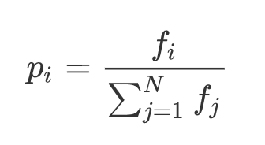
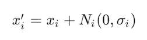

# EMbArK: Evolutionary MAchi Koro

[](https://travis-ci.org/ElliotPenson/embark)

An engine for the Japanese game Machi Koro with a genetic algorithm (GA) to
generate AI. This algorithm generates strategies encapsulated in probability
vectors. Once iteration completes, the program gives users the opportunity to
play against the AI through a command-line interface.

## What Is Machi Koro?


Machi Koro is a city-building, card-based board game. Each turn, the current
player rolls the dice, earns coins, and purchases one card. The first player to
build all four landmark cards wins the game.

## Execution

```
virtualenv venv                  # Create a virtual environment.
. venv/bin/activate              # Activate the virtual environment.
pip install -r requirements.pip  # Install dependencies.
python -m embark                 # Run embark.
```

Algorithm parameters may be adjusted in `embark/parameters.py`.

## How Does EMbArK Work?

Players in Machi Koro must answer the question "which card should I purchase
next?" Such a game is ripe for an AI. EMbArK uses a genetic algorithm to search
for the optimal strategy. The algorithm maintains a set of organisms which play
Machi Koro with reference to a chromosome, which can be thought of as a game
strategy. Within the organism, each card is represented by a floating-point
gene. Intuitively, the numbers associated with each gene represent the
likelihood the AI will purchase a particular card.

EMbArK begins by creating a set (*generation*) of organisms with random
chromosomes. These organisms play the rest of their generation to determine the
relative effectiveness of their assigned strategy. The winningest organisms are
*selected* for reproduction based on their performance and are used to create
the next generation of organisms, which then repeats the competition among
organisms. When the next generation is created, some organisms experience
*mutation*, which adds diversity to the strategies. The algorithm simulates a
configurable number of generations.

### Selection

A portion of the population is selected to breed a new generation. EMbArK uses
*fitness-proportionate selection* to determine parents. The fitter the organism,
the more likely its selection. Each organism's fitness is defined as the number
of wins against all other individuals in the generation. Selection probability
is equal to the fitness of an individual divided by the sum of all fitnesses.



### Reproduction

Reproduction, called *crossover* or *recombination* in the literature, takes two
parent organisms and produces one child organism. EMbArK uses the *uniform
crossover scheme*. The child's genes are chosen from those of the parents with a
fixed probability (called the *recombination probability*).

### Mutation

*Mutation* introduces genetic diversity to the population. EMbArK uses *gaussian
mutation*. This operation adds a value taken from a Gaussian random variable to
the chosen gene.



The probability that a *gene* is mutated is 1/l where l is equal to the number
of genes. The likelihood that an *organism* is mutated is called the *mutation
probability*. This value may be configured in `embark/parameters.py`.

See this repository's [IPython notebook](https://github.com/ElliotPenson/embark/blob/master/embark-analysis.ipynb)
for an analysis of performance.
